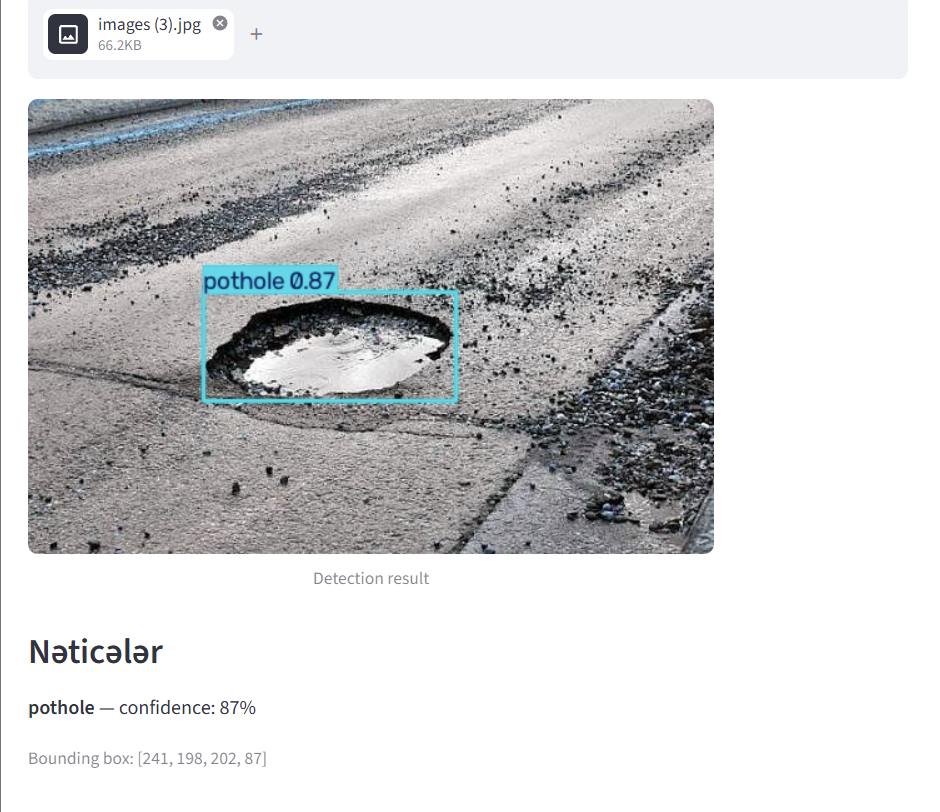
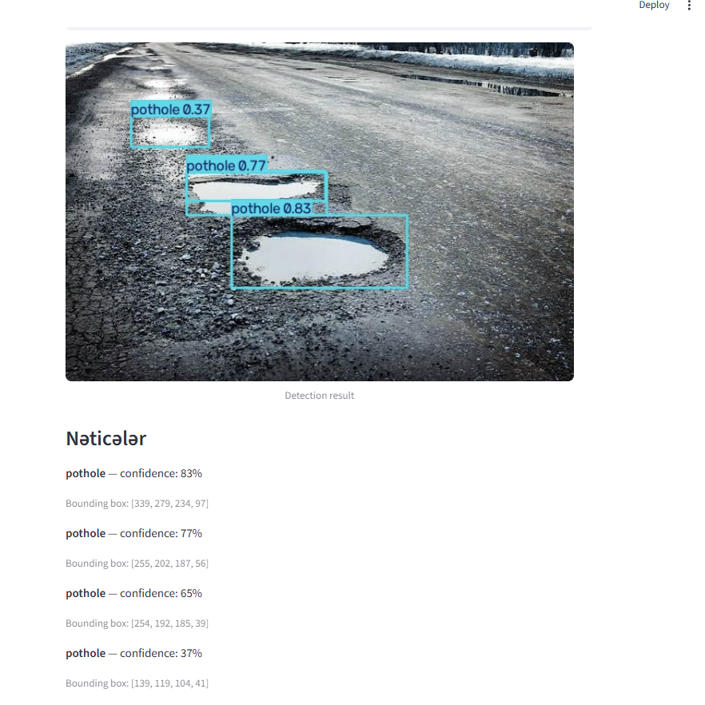
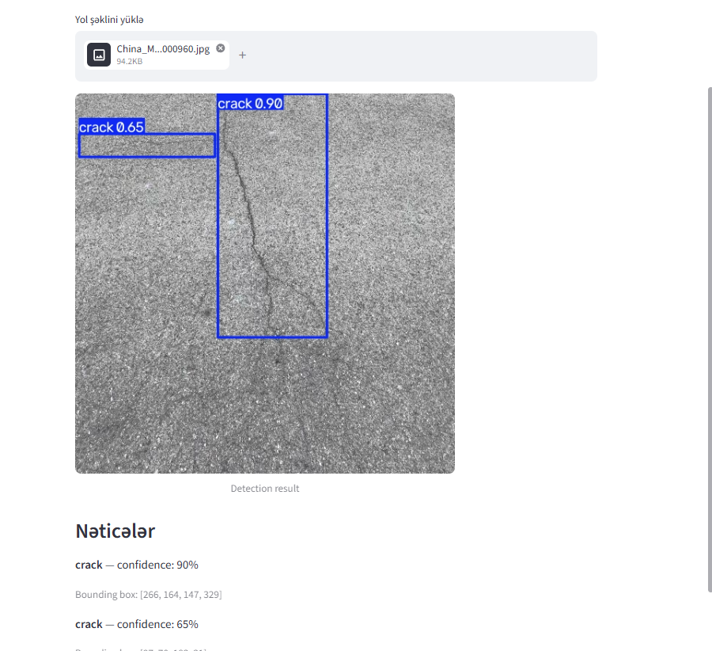

# 🚧 RoadGuard

AI-Powered Road Damage Detection Platform

**Detect. Report. Map.**

RoadGuard detects road damage (potholes and cracks) from road images using a YOLO object detection model. For each detection it returns the damage class, a bounding box and a confidence score.

## Sprint 1 Status (25%)

Working prototype:

- Upload a road image
- YOLO model analyzes it
- Damage class + bounding box + confidence score are displayed

Not yet implemented (next sprints): backend API, database, location data, interactive map.

## Model

- Architecture: YOLO11n (Ultralytics)
- Dataset: "crack and pothole" (Roboflow Universe, CC BY 4.0), classes: crack, pothole
- 3,653 original images; the exported version (with augmentation) has 11,340 images (10,244 train / 731 validation)
- Training: 25 epochs, image size 640, Google Colab (Tesla T4), about 1.2 hours

## Results (validation set)

| Class | Precision | Recall | mAP50 |
|---|---|---|---|
| all | 0.851 | 0.748 | 0.815 |
| crack | 0.874 | 0.859 | 0.902 |
| pothole | 0.828 | 0.636 | 0.728 |

Inference speed: about 11 ms per image on a T4 GPU.

## Demo

Pothole examples are images taken from the web. Crack examples come from the dataset.

## Limitations

- The model works best on close-up photos of asphalt roads.
- Accuracy drops on gravel or unpaved roads, wide street views with thin cracks, and low-quality images.
- Pothole recall (0.636) is lower than crack recall; more pothole data is planned.
- The same damage can sometimes be detected twice with overlapping boxes.

## How to run

1. Install Python 3.13
2. Install dependencies: `pip install ultralytics streamlit`
3. Put `best.pt` and `app.py` in the same folder
4. Run: `streamlit run app.py`

## Next Sprint

- Backend API (`POST /detect`)
- Database for reports
- Location data
- Interactive map