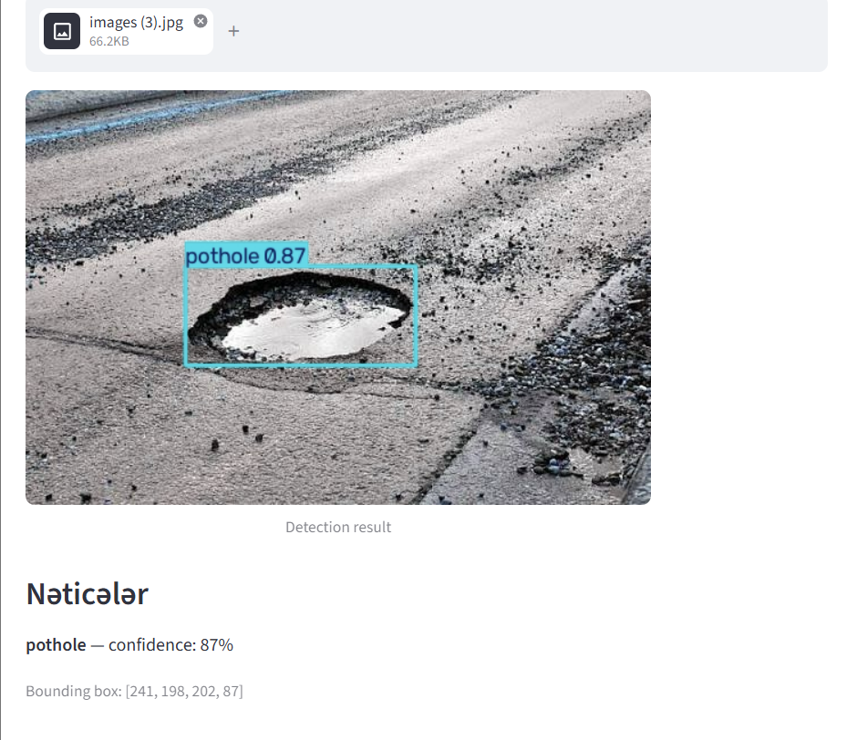
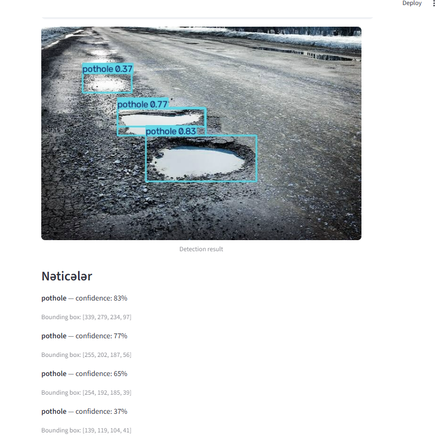
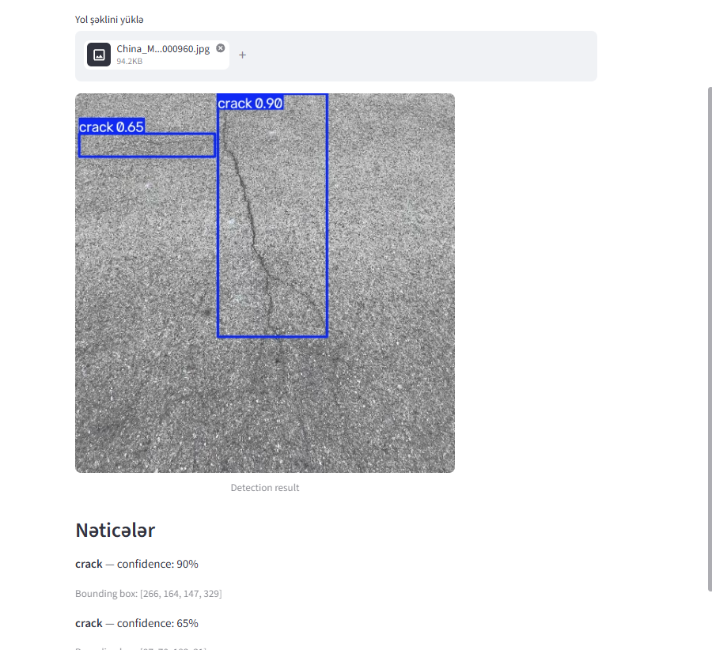

# 🚧 RoadGuard

AI-Powered Road Damage Detection Platform

**Detect. Report. Map.**

RoadGuard detects road damage (potholes and cracks) from road images using a YOLO object detection model. For each detection it returns the damage class, a bounding box and a confidence score. Results are now stored in a PostgreSQL database via a FastAPI backend.

## Project Status

- **Sprint 1 (25%)** — ✅ Complete: working prototype (Streamlit + YOLO)
- **Sprint 2 (50%)** — ✅ Complete: backend API + database integration

## Architecture

[Streamlit frontend] → HTTP POST → [FastAPI backend] → YOLO model
↓
[PostgreSQL database]


- **Frontend (`app.py`)**: Streamlit app. User uploads an image and sets a confidence threshold; sends the image to the backend and displays the annotated result.
- **Backend (`main.py`)**: FastAPI app. Runs YOLO inference, draws bounding boxes, saves each detection to PostgreSQL, and returns the results (including the annotated image) as JSON.
- **Database**: PostgreSQL, `roadguard` database, `reports` table.

## Model

- Architecture: YOLO11n (Ultralytics)
- Dataset: "crack and pothole" (Roboflow Universe, CC BY 4.0), classes: crack, pothole
- 3,653 original images; the exported version (with augmentation) has 11,340 images (10,244 train / 731 validation)
- Training: 25 epochs, image size 640, Google Colab (Tesla T4), about 1.2 hours

## Results (validation set)

| Class | Precision | Recall | mAP50 |
|---|---|---|---|
| all | 0.851 | 0.748 | 0.815 |
| crack | 0.874 | 0.859 | 0.902 |
| pothole | 0.828 | 0.636 | 0.728 |

Inference speed: about 11 ms per image on a T4 GPU.

## Database Schema

Table `reports`:

| Column | Type | Description |
|---|---|---|
| id | SERIAL PRIMARY KEY | Auto-incrementing ID |
| damage_type | VARCHAR(50) | "crack" or "pothole" |
| confidence | FLOAT | Model confidence score |
| latitude | DOUBLE PRECISION | Location (optional, planned for next sprint) |
| longitude | DOUBLE PRECISION | Location (optional, planned for next sprint) |
| image | VARCHAR(255) | Original filename |
| created_at | TIMESTAMP | Auto-set on insert |

## API

### `POST /detect`

Accepts a road image, runs detection, saves results to the database, and returns the annotated image plus detection details.

**Request (multipart/form-data):**
- `file`: image file (jpg/jpeg/png)
- `conf`: confidence threshold (float, default 0.25)
- `latitude`, `longitude`: optional location (float)

**Response (JSON):**
```json
{
  "filename": "pothole.jpg",
  "detections_count": 1,
  "detections": [
    {"damage_type": "pothole", "confidence": 0.8676}
  ],
  "annotated_image": "<base64-encoded JPEG>"
}
```

Interactive API docs available at `/docs` (Swagger UI) when the server is running.

## Demo





Pothole examples are images taken from the web. Crack examples come from the dataset.

## Limitations

- The model works best on close-up photos of asphalt roads.
- Accuracy drops on gravel or unpaved roads, wide street views with thin cracks, and low-quality images.
- Pothole recall (0.636) is lower than crack recall; more pothole data is planned.
- The same damage can sometimes be detected twice with overlapping boxes.
- Location (latitude/longitude) is currently optional and not yet populated by the frontend; map integration is planned.

## How to run

1. Install Python 3.13
2. Install dependencies:

pip install ultralytics fastapi uvicorn python-multipart psycopg2-binary streamlit requests

3. Install PostgreSQL and create the database:
```sql
   CREATE DATABASE roadguard;
```
   Then create the `reports` table (see [Database Schema](#database-schema) above for column definitions, or run the `CREATE TABLE` statement from `main.py`'s setup).
4. Update the `DB_CONFIG` dictionary in `main.py` with your PostgreSQL username/password.
5. Put `best.pt`, `main.py`, and `app.py` in the same folder.
6. Start the backend:

uvicorn main:app --reload

7. In a separate terminal, start the frontend:

streamlit run app.py

8. Open `http://localhost:8501` in your browser.

## Next Sprint

- Location input (latitude/longitude) from the frontend
- Interactive map (Folium/Leaflet) showing all reported damage
- Deduplication of overlapping detections
